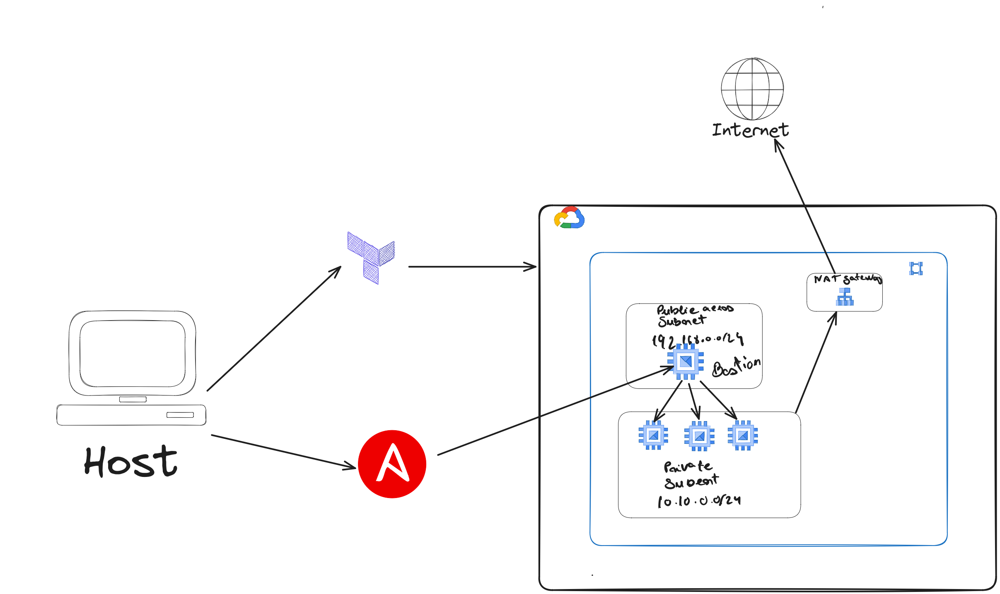

# SysAdmCephCluster




## How to setup the environment 

## enter into ansible folder
```bash
cd SysAdmCephCluster/ansible
```

### Generate bastion ssh keys 
```bash
ansible-playbook -i inventory build_project/generate_ssh_keys.yaml --tags ssh_keys -vv
```
### create tf state bucket, build tfvars and build inventory
```bash
ansible-playbook -i inventory build_project/main.yaml  --extra-vars "command=(apply or destroy)"  -vv
```

### execute terraform to setup the whole infrastructure infrastructure
## enter into terraform folder
```bash
cd SysAdmCephCluster/terraform
```
```bash
./executor.sh base apply
./executor.sh cephObjectStorageDevice apply
./executor.sh cephManager apply
./executor.sh cephMonitor apply
./executor.sh cephRDB apply
```

### generate ssh proxy locally
```bash
ansible-playbook -i inventory bastion/build_local_proxy.yaml --tags proxy_jump --ask-become-pass  -vv
```
### execute common configurations amoung all hosts
#### command to apply in every node.
```bash
ansible-playbook -i inventory common/init.yaml -l all --tags ceph_init,ceph_node,ceph_client --key-file "../ssh_keys/idrsa"  -vv
```
#### command to apply seperatly
```bash
ansible-playbook -i inventory common/init.yaml -l bastion --tags ceph_init --key-file "../ssh_keys/idrsa"  -vv
```
### configure ceph monitor and manager nodes
```bash
ansible-playbook -i inventory cephCluster/cephManager.yaml -l manager --tags ceph_manager,ceph_monitor --key-file "../ssh_keys/idrsa"  -vv
```

### configure osd node
```bash
setup ceph osd
ansible-playbook -i inventory cephCluster/cephOSD.yaml -l osd --tags ceph_osd --key-file "../ssh_keys/idrsa"  -vv
```
### configure rdb node
```bash
setup ceph rdb
ansible-playbook -i inventory cephCluster/cephRDB.yaml -l rdb --tags ceph_rdb --key-file "../ssh_keys/idrsa"  -vv
```

### usefull commands
```bash
ceph -s
ceph osd tree
ceph df 
ceph osd df 
```