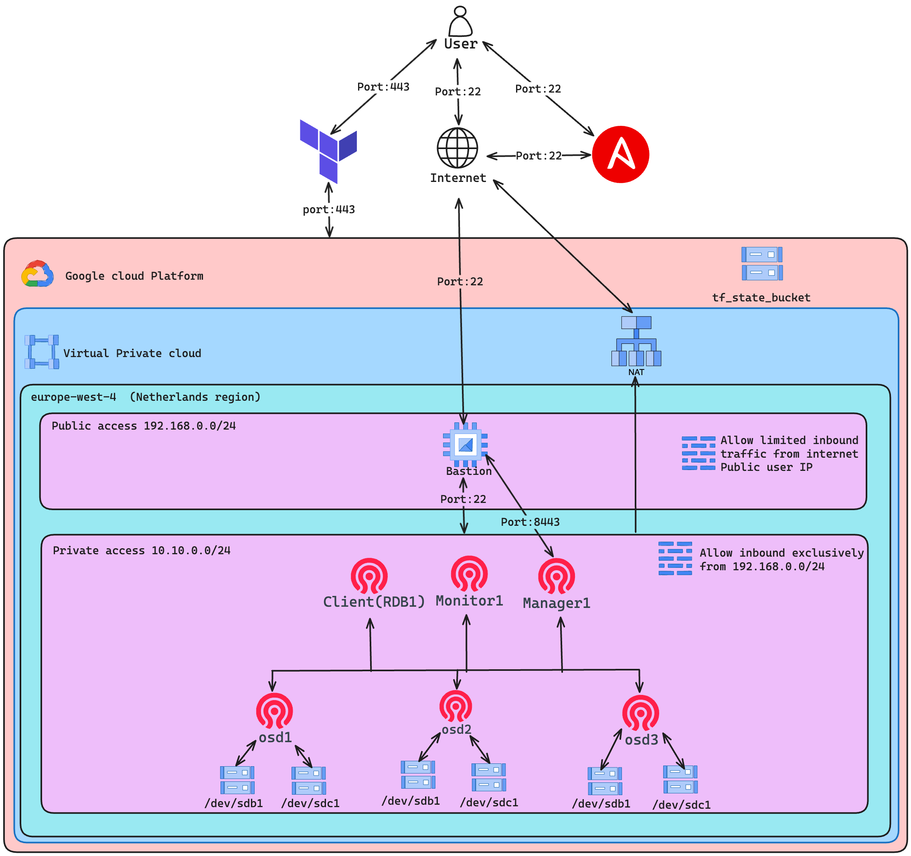

# SysAdmCephCluster

SysAdmCephCluster was developed by Jorge Mendes up202308811@up.pt, José Carvalho up202005827@fc.up.pt and Eduardo Correia up201909914@fc.up.pt As part of the semester project for the System Administration class in the Master's program in Network and Information Systems Engineering at the Faculty of Science, University of Porto, the project has the scope of deploying a Ceph cluster in the Google Cloud Platform. This involves a Distributed Storage Cluster, Client Integration, and a Backup Solution with Rsync, using Terraform as the infrastructure provisioner.

###### Table of contents
1. [Architecture diagram](#diagram)
    1. [Architecture decisions](#arch_decesions)
    2. [Terraform structure](#tf)
    3. [Ansible structure](#ansible)
2. [Configurations](#configs)
3. [Backup statagies](#bk)
4. [System Troubleshooting](#trbl)
5. [System Recovery](#recovery)
6. [How to setup the ceph cluster project](#setup)

### Architecture diagram <a name="diagram"></a>

#### Architecture decisions <a name="arch_decesions"></a>
In this project, our team established various guidelines that have culminated in the present architecture. One of the essential principles we incorporated is the need for a secure architecture. In a real-life scenario, every cluster must have private access. According to cloud provider’s best practices, the default Virtual Private Cloud (VPC) should only be utilized for testing purposes as it lacks constraints and security measures, posing a severe security risk. Consequently, for this project was created a  **Virtual Private Cloud** with 2 separated private subnets 192.168.0.0/24 and 10.10.0.0/24. The subnet 192.168.0.0/24, is publically accessible as bastion host serves as a proxy jump from the Administrator to the Ceph cluster, while a firewall rule allows inbound public traffic from the Administration public IP address on port 22. Additionally, this subnet was created with the necessary security measures to ensure that the public access does not compromise the overall security of the architecture.

Additionaly, the subnet 10.10.0.0/24 is a private subnet that will host the entire ceph architecture. Therefore, having these resources exposed publicly would pose a significant risk. we defined this subnet as private by implying firewall rules that only allow inbound requests from 192.168.0.0/24 network. However the ceph nodes require access to internet to pull software. Therefore was additionaly created a NAT router that grants outbound connectivity for ceph instances.

To deploy the architecture into Google Cloud it has decided to divide the deployment into tow separate phases: infrastructure provisioning and configuration management. Terraform was used as an infrastructure as code tool for infrastructure provisioning. While ansible was used for configuration management. This segmentation aims to enhance the agility towards the architecture configuration. In case a node faces issues, with Ansible,  it is possible to operate isolated or multiple commands based on defined workflows, tags, and playbook. If the configuration was implied using cloud-init on Terraform, it would be impossible to modify the instance without destroying it and causing downtime.

#### Terraform structure <a name="tf"></a>
The current project utilizes a terraform structure based on modules, with the `executer.sh` script serving as the primary interface to execute terraform commands. This script executes terraform actions based on an input module and operation type (apply or destroy) and thereby reduces the number of required input parameters. Furthermore, the script automatically initializes Terraform and includes Terraform parameters that facilitate the use of a custom tf state backend, which points to a bucket housing tf states. This approach supports concurrent work by two team members on the project without the risk of interfering with each other's resources. 
The terraform actions performed within the `executer.sh` script occur within an ephemeral target folder with a single execution timespan, during the execution, which files from the targeted module and the common folder are copied. The common folder contains terraform variables, backend configuration, and terraform providers. It is worth noting that prior to initiating the project's module provisioning, is required a preemptive provisioning of a bucket that will function as the terraform state backend.

Managing and maintaining infrastructure that involves multiple cloud resources can be overwhelming. To make it easier, cloud architect's commonly use modular approaches reduce the number of duplicated resources, generate fewer dependencies and simplify the creation of resources from the same type. In the presented architecture the resources are located in the “modules” folder and are segregated based on whether they are networking, computing, security or storage resources.

Additionally, the modules available to be provisioned are the `base` module which provisions the VPC, the subnets the nat resources and the firewall rules. The second module is the `cephCluster` which is responsible for provisioning virtual machine instances and HDD storage devices intrinsically correlated with the Ceph object storage devices (OSD).


<details>
  <summary>terraform directory structure</summary>
  
  ```bash
terraform
├── base
│   ├── locals.tf
│   ├── main.tf
│   └── outputs.tf
├── cephCluster
│   ├── main.tf
│   └── remote_state.tf
├── common
│   ├── data.tf
│   ├── providers.tf
│   ├── tfstate_backend.tf
│   └── variables.tf
├── env.tfvars
├── executor.sh
├── modules
│   └── gcp
│       ├── compute
│       │   ├── private_vm
│       │   │   ├── main.tf
│       │   │   ├── outputs.tf
│       │   │   └── variables.tf
│       │   ├── public_vm
│       │   │   ├── main.tf
│       │   │   └── variables.tf
│       │   └── storage
│       │       ├── main.tf
│       │       ├── outputs.tf
│       │       └── variables.tf
│       ├── firewall_rules
│       │   ├── main.tf
│       │   └── variables.tf
│       ├── network
│       │   ├── nat
│       │   │   ├── main.tf
│       │   │   └── variables.tf
│       │   ├── subnet
│       │   │   ├── main.tf
│       │   │   └── variables.tf
│       │   └── vpc
│       │       ├── main.tf
│       │       ├── outputs.tf
│       │       └── variables.tf
│       └── storage_bucket
│           ├── main.tf
│           └── variables.tf
└── tf_state_bucket
    ├── main.tf
    ├── providers.tf
    ├── terraform.tfstate
    ├── terraform.tfstate.backup
    └── variables.tf

18 directories, 43 files
  ```
</details>

#### Ansible structure <a name="ansible"></a>
As previously indicated, using Ansible allows the creation of configuration workflows based on playbooks and tags. Ansible effectively  communicates with the google cloud API obtaining the instances metadata which contains the private and public IP address of every node and groups them according to their names.

The “generate_ssh_keys” playbook contained in the “build_projcet” folder generates a bastion SSH key pair used for authenticating instance. the “main.yaml” playbook generates the “env.tfvars” file with project configurations based on “ceph_cluster_configuration.yaml” located in the project root folder. It also executes the terraform commands to create the tf state bucket.

Additionally, the "init.yaml” playbook, modifies locally the /etc/ssh/ssh_config file to allow jumping to 10.10.0.0/24 private subnet using the bastion host.

Lastly, within the cephCluster folder are present the playbooks responsible for configuring the Ceph cluster separated depending of his role.

<details>
  <summary>ansible directory structure</summary>

  ```bash
ansible
├── ansible.cfg
├── bastion
│   └── init.yaml
├── build_project
│   ├── generate_ssh_keys.yaml
│   └── main.yaml
├── cephCluster
│   ├── cephManager.yaml
│   ├── cephMonitor.yaml
│   ├── cephOSD.yaml
│   ├── cephRBD.yaml
│   └── cephRestoreMonitor.yaml
├── common
│   └── init_task.yaml
└── inventory
    └── inventory.gcp.yml

6 directories, 11 files
  ```
</details>

### Configurations <a name="configs"></a>
To Configure a Ceph cluster are available multiple possible ways. However, In this project, we have chosen a manual installation which challenges us to enhance our understanding of the technology and learn how the tool works behind the scenes.

The first component that we configured is the "monitor" node. Initially, “cephMonitor.yaml” ansible-playbook executes the command `uuidgen` to generate the ID of the Ceph cluster. This id is inserted into the the “ceph.conf” like other parameters used for cluster configuration: `cluster network`, `monitor host` and `mon initial members`. Furthermore, to authenticate the remaining Ceph resources we generated keyring resources that are used throughout the cluster like the `ceph monitor`, `client admin` and `osd bootstrap`. Concluded the generation of keys will be created the monitor map that has the state of the entire cluster with the command `monmaptool --create --add {{ item.instance_name }} {{item.private_ip}} --fsid {{ item.uuid }} /etc/ceph/monmap`. Finally, after creating the previous resources will be created the cluster per se using the command `monmaptool --create --add {{ item.instance_name }} {{item.private_ip}} --fsid {{ item.uuid }} /etc/ceph/monmap` and start the daemon. 

Similarly, the `cephManager.yaml`, `cephOSD.yaml` and the `cephRBD.yaml` relocate the configuration files provided by the “cephMonitor.yaml” playbook. Whereas, the cephManager only starts the manager daemon. The cephOSD,yaml partitioned the disk at 100% of its capacity and created a volume with the lvm tool. For example, in this project, the HDDs are mounted in `/dev/sda`, `/dev/sdb` and `/dev/sdc`. However, upon instance creation, there is already a volume mounted at “/dev/sda1. Which we descarded for the Ceph storage system. 

Conversely, the `cephRBD.yaml`, configures the client that will create and initialize the object storage pool and create an XFS filesystem `/dev/rbd0` in the `/mnt` directory. Natively, the crated volumes don't have the full capacity available and in the worst-case scenario losing 1 OSD node could result in corruption data within the pool. Therefore, the file system was created with proximatly less 33% of his full capacityity for failover purposes. Moreover, the “cephRDB” playbook installs and configures a Postgres database which has a random database with 200 rows of random data to simulate the storage consumption from the Ceph cluster.


### Backup strategies <a name="bk"></a>
Defining backups and restore procedures grants data protection and lower the MTTR (Mean time to recover). For scope of the project was designing backup strategies for the monitor node and the Postgres database located in the RBD node. For the monitor is installed a crontab job that will be triggered by the system every minute thereby executing a script that synchronizes with the manager node the files in the `/etc/ceph` and `/var/lib/ceph` folders. Moreover after each execution the output is stored in a log file located in `/home/bastion/crontab.log` to augment the visability towards the backup procedure and to ensure data integrity, before the backup generation the scipt verifies if the monitor daemon is active otherwise the process will be skipped.

<details >
  <summary>monitor crontab logs</summary>

```bash
root@monitor1:~# tail -f /home/bastion/cronjob.log
syncing directory -> /var/lib/ceph/
syncing directory -> /etc/ceph/
syncing directory -> /var/lib/ceph/
syncing directory -> /etc/ceph/
service is not active quiting...
```
</details>

Similarly, the backup procedures for the RBD Postgres database also take into consideration if the Postgres service is active. However, this procedure has 2 levels of backups. The first level is essentially a partial backup when the node is still online although, the Postgres service is down due to errors. The cronjob compresses the Postgres data within a tar.gz file and stores it locally in `/home/bastion/postgres/backups` the latest 5 backups. On the other hand, the second procedure is for scenarios where the node is completely offline and the data inside is unavailable. Therefore the data is additionally sent with the `rsync` command to `/home/bastion/postgres/backups` located in the manager node. 

<details >
  <summary>RBD crontab logs</summary>

  ```bash root@rbd1:~# tail -f /home/bastion/crontab.log
  number of backups =>0
  postgresql service is =>active
  number of backups =>1
  postgresql service is =>active
  number of backups =>2
  postgresql service is =>active
  number of backups =>3
  postgresql service is =>active
  number of backups =>4
  postgresql service is =>active
  number of backups =>5
  postgresql service is =>active
  number of backups exceeds maximum of 5
  removing oldest backup database_bk_1702043521.tar.gz
  generating backup => database_bk_1702043821.tar.gz
  number of backups =>5
  postgresql service is =>active
  number of backups exceeds maximum of 5
  removing oldest backup database_bk_1702043581.tar.gz
  generating backup => database_bk_1702043881.tar.gz
  number of backups =>5
  postgresql service is =>inactive
  number of backups =>5
  postgresql service is =>inactive
  ```
</details>

### Troubleshooting steps <a name="trbl"></a>
Troubleshooting is a crucial process to identify and resolve issues and raise awareness about what is happening in the system. To troubleshoot failing or misconfigured services multiple commands were used. For instance, if the service is failing the recommended troubleshooting steps are checking the status of the service with the `systemctl status (service name)` command or analysing logs with the command `journalctl -u (service name).` The logs located in `/var/log/ceph/` grant an efficient debugging solution. Additionally, the `ceph -s` command can be used to analyze the status of the cluster or to check the health status by executing the `ceph health` command. On the other hand, the command `ceph df` analyzes data usage and distribution among pools. Finally, the `ceph ODS dump` command provides detailed information about the OSD. It can also be used simultaneously for other resources within the Ceph environment.

### System Recovery <a name="recovery"></a>
In the event of a failure, system recovery can be achieved by restoring the pre-established backups. The restoring process for the monitor involves executing the cephRestoreMonitor playbook, which adds the data to their respective directories. After restoring the data, the service is then ready to be restarted. Similarly to the monitor restore, the postgres database recovery is quite similar diverging if is used the backup stored locally or remotely in the manager node. Moreover, to accomplish the database restore the `cephRBD` playbook with the tag restore is sufficient to recover the database service locally.

## How to setup the ceph project <a name="setup"></a>
### Prerequisites<a name="req"></a>
* google cloud cli installed
* ansible installed
* execute `ansible-galaxy collection install google.cloud` for ansible access gcp api
* terraform installed `version >=v1.6.1`
* authenticate with Google cloud cli `gcloud auth application-default login`
* Identity and Access Management (IAM) API enabled
* Compute Engine enabled (action made through GCP UI)
* install google auth library `pip install google-auth`
* install python requests library `pip install requests`


### Enter into ansible folder
```bash
cd SysAdmCephCluster/ansible
```

#### Generate bastion ssh keys 
```bash
ansible-playbook -i inventory build_project/generate_ssh_keys.yaml --tags ssh_keys -vv
```
Generates SSH keys for the necessary environment access. These keys are stored locally in the root directory of the repository.

#### create tf state bucket, build tfvars and build inventory
```bash
ansible-playbook -i inventory build_project/main.yaml  --extra-vars "command=apply"  -vv
```
Generates the inventory used by ansible to retrieve all instances metadata deployed in the project. The data used from that API are: The private IP address from ceph nodes, the public IP address from bastion host and the instance hostnames.
Furthermore, this playbook also generates the tf vars used by the terraform in this project.

The variables used in both ansible and terraform are set on `ceph_cluster_configuration.yml`  file in order to make the project dynamic and adjustable to everyone.
Finally, it also creates the tf_state bucket that will store all terraform states generated by each module that terraforms provisiones.
This ansible execution accepts as a command the option `apply` or `destroy`.


#### Execute terraform to setup the whole infrastructure infrastructure
##### Enter into terraform folder
```bash
cd SysAdmCephCluster/terraform
```
```bash
./executor.sh base apply
./executor.sh cephCluster apply
```

After the creation of the tfstate bucket, the following step is to provision the whole infrastructure that will host the ceph cluster. The infrastructure is splitted into 2 modules. The `base` and the `cephCluster`. Whereas the base module file is responsible for provision 1 VPC, 2 Subnets (private and public access subnet), firewall rules, Nat router and bastion host. On other hand, the cephCluster module is responsible for provisioning all resources directly related with the ceph cluster such as the Manager and monitor nodes, the OSD, RDB, and by default 2 HDD volumes per OSD node.


##### Generate ssh proxy locally
```bash
ansible-playbook -i inventory bastion/init.yaml --tags ceph_init,apply --ask-become-pass --key-file "../ssh_keys/idrsa"  -vv
```

In order to access all the infrastructure, hosted in the private subnet (10.10.0.0/24), for security purpuse is crucial to create a proxy jump between the localhost where the ansible is being executed to the destination network. Therefore, regarding that bastion host that is accessible from the public network on port 22 is being used as a proxy to jump to the Ceph Network.
The following image shows an example of a ssh_config file after executing the ansible command.
In this ansible command is passed the `proxy_jump` tag, and the `--ask-become-pass` to escalate priveligies to write into `/etc/ssh/ssh_config` file

<details open>
  <summary>/etc/ssh/ssh_config example</summary>
</IMG>
</details>

##### Configure ceph monitor node
```bash
ansible-playbook -i inventory cephCluster/cephMonitor.yaml -l monitor --tags ceph_init,ceph_monitor,ceph_osd,ceph_rbd,ceph_manager,backup   --key-file "../ssh_keys/idrsa"  -vv
```
The cephMonitor playbook configures the monitor node, generates the backup process, and send remotely the ceph config file and the keyring to other ceph instances.

##### Configure ceph manager nodes
```bash
ansible-playbook -i inventory cephCluster/cephManager.yaml -l manager --tags ceph_init,ceph_manager --key-file "../ssh_keys/idrsa"  -vv
```
##### Configure ceph manager dashboard
```bash
ansible-playbook -i inventory cephCluster/cephManager.yaml -l manager --tags ceph_manager_dashboard --key-file "../ssh_keys/idrsa"  -vv
```
The cephManager playbook configures the manager nodes and enable the ceph dashboard. Based on the tag provided will be configured the ceph_manager if provided the tag `ceph_manager`  whereas if the tag provided is `ceph_manager_dashboard` will enable the dashboard plugin and configureing the user and password.


##### configure osd node
```bash
ansible-playbook -i inventory cephCluster/cephOSD.yaml -l osd --tags ceph_init,ceph_osd --key-file "../ssh_keys/idrsa"  -vv
```
The cephOSD playbook formats the entire HDD volume and mount it on `/dev/sdb1`, `/dev/sdc1`, ...

<details open>
  <summary>OSD Node status</summary>
</IMG>
</details>

##### Configure rbd node
```bash
ansible-playbook -i inventory cephCluster/cephRBD.yaml -l rbd --tags ceph_init,ceph_rbd,database,backup --key-file "../ssh_keys/idrsa"  -vv
```
<details open>
  <summary>Client (RDB Node)</summary>
</IMG>
</details>


The cephRBD playbook mainly creates the RBD Pool, maps the block device, format the volume in XFS format, and mount the volume `/dev/rbd0` into a mounted directory `/mnt`.
Furthermore, when is additionaly inserted `database` tag will install postgres, sync the default postgres data from `/var/lib/postgresql/16/main/` to `/mnt/database/lib/postgresql/16/main/`, modifies the data directory parameter from postgres configuration file and create a ramdom table with 200 rows with ramdom data. On other hand, with the tag `backup`the playbook will create a directory (`/home/bastion/postgres/backup`) where is located the database backups, creates a crontab job that every minute generates a backup file compressed in `tar.gz` format.

### postgres commands
<details open>
  <summary>first 50 results from postgres database</summary>
    
  ```bash 

  root@rbd1:~# sudo -u postgres psql -c "select * from randomtable limit 50;"
   id |           random_text            |   random_number    | random_integer | random_date
  ----+----------------------------------+--------------------+----------------+-------------
    1 | b06af2d3106b653d77a0625eb1cafb2a |  196.1698110577663 |             88 | 2567-10-01
    2 | 60e44f1937935bb73bd46b4c6ae5b1b8 | 187.50099342575544 |            507 | 2419-08-10
    3 | 05f0476cc36b58b233b9116a82100b78 |  642.6980756701013 |             23 | 2506-11-14
    4 | e0a0d554c343e7c7e1cf312ff780646d |  92.62785448726873 |            514 | 2432-04-26
    5 | 2e3beff40cb537281d1a1ce481509686 |  87.55502664444026 |            582 | 2578-02-14
    6 | 5f40d2945c8443dc7e64bbaad71db96c |  412.5930307965775 |            711 | 2236-07-17
    7 | d4f49b3c04dc6b8f0052aabb952d078a |  724.6586797408154 |            279 | 2766-07-23
    8 | 8c5325d8445178dc423270824c05a4bf | 165.49187002089784 |            229 | 2755-12-01
    9 | 6460f21ab04f7a3d58b40ea76ea4d125 |    779.99208007664 |            852 | 2163-12-10
   10 | 8192919c71cd29220c1c46169afb080d |  961.6014742822747 |            287 | 2723-01-12
   11 | 3b95a5bc1ff228bb85ba0db8200853ac | 488.08139204023627 |            317 | 2213-12-13
   12 | b6b81856cb1b627e919712b2387b0295 |  770.0333900128958 |            624 | 2330-02-08
   13 | 82ba1d7159d979225bac2dd197784086 | 360.72665659398575 |            936 | 2447-04-19
   14 | 230f5cdb59dba8bdddd393be52bd0338 |  7.678168694612797 |            424 | 2337-04-15
   15 | 60a9d75251a602d34abdcfa258d4e687 |  544.3859142302358 |            941 | 2005-05-12
   16 | 865768fd8df6a7a88681a1245d95b1e3 |  145.1951243013969 |            508 | 2174-01-18
   17 | f8fcd87d6bd84a431e6f4eac494ef6c2 |  265.7649323542377 |            741 | 2145-01-25
   18 | ba05450928345f17e083019f5f2c962b |  685.9257099105307 |            271 | 2550-02-19
  ```
</details>


### Usefull commands
##### Remote access bastion host
```bash
cd SysAdmCephCluster/ansible
ssh -i ../ssh_keys/idrsa  bastion@(bastion public ip)
```
##### Remote access ceph instances
```bash
ssh (ceph instance private ip)
```

##### ceph commands to check the cluster status
```bash
ceph -s
ceph osd tree
ceph df 
ceph osd df 
```


##### Access dashboard via proxyjump
```bash
cd SysAdmCephCluster
ssh -i ../ssh_keys/idrsa -L 127.0.0.1:8443:(ceph_manager_private_address):8443 bastion@(bastion_public_address)
```

### Restoring process
#### restore monitor
```bash
ansible-playbook -i inventory cephCluster/cephRestoreMonitor.yaml --tags ceph_init,monitor_restore,monitor_restore_service   --key-file "../ssh_keys/idrsa"  -vv
```

##### restore database in rdb node
```bash
ansible-playbook -i inventory cephCluster/cephRBD.yaml -l rbd --tags restore --key-file "../ssh_keys/idrsa"  -vv
```

### Destroy cluster
```bash
cd SysAdmCephCluster/terraform

./executor.sh cephCluster destroy
./executor.sh base destroy
```

### Destroy tf state bucket

```bash
cd SysAdmCephCluster/ansible

ansible-playbook -i inventory build_project/main.yaml  --extra-vars "command=destroy"  -vv
```

